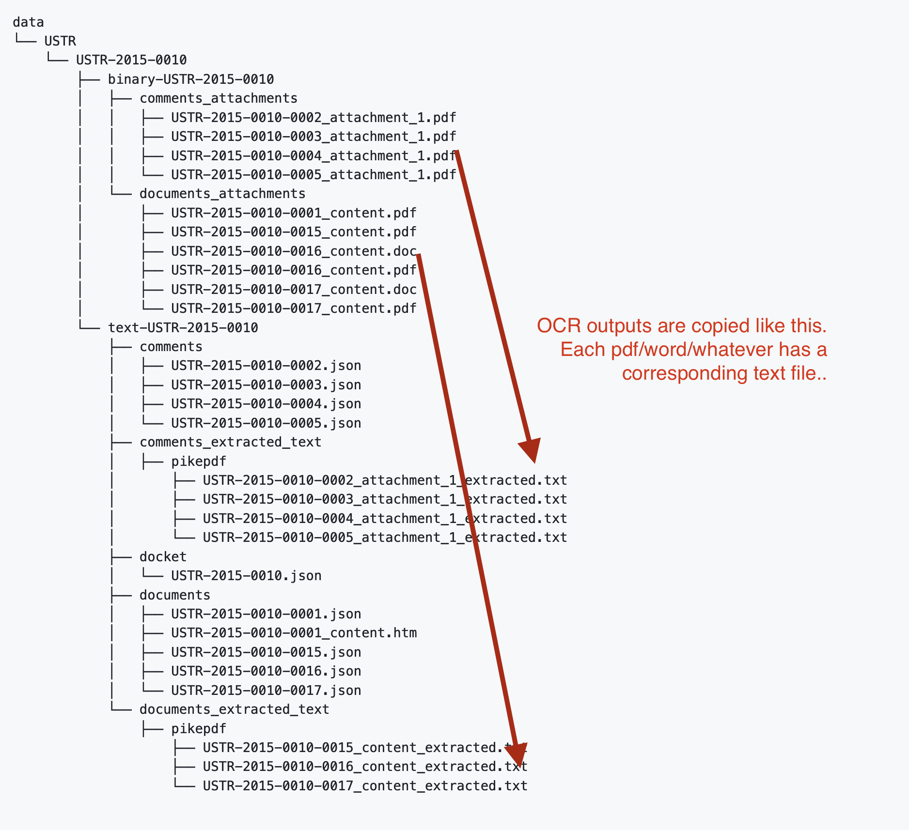

# Mirrulations Regulation Data
A repository with instructions for accessing data from the mirrulations project. 

## S3 Access
The Mirrulations project publishes its results at the following S3 Bucket. 

```
s3://mirrulations
```

Mirrulations uses 

## How to download
The simplest way to download the data, is to use rclone. 
We have written [some helper scripts that will help automate the rclone commands](/scripts/rclone/). 

Using the script it is simple to download data by year, by Federal agency, and to decide to download the raw text only, or to download both the raw text and the originals (generally pdfs and word documents).


## Data License

Regulations data is public domain under the [edicts of government](https://en.wikipedia.org/wiki/Edict_of_government) principle. 

With this in mind, we are formally labeling the data as Public Domain, by using the [Creative Commons Public Domain mark](https://creativecommons.org/publicdomain/mark/1.0/):

<p xmlns:dct="http://purl.org/dc/terms/">
<a rel="license" href="http://creativecommons.org/publicdomain/mark/1.0/">

</a>
<br />
This work (<span property="dct:title">Mirrulations Regulation Data</span>, by <a href="https://regulations.gov" rel="dct:creator"><span property="dct:title">Participants in pulic regulatory process</span></a>), identified by <a href="https://github.com/MoravianUniversity/mirrulations" rel="dct:publisher"><span property="dct:title">Mirrulations Project</span></a>, is free of known copyright restrictions.
</p>

We have also added a text version of this assertion in the data_LICENSE.txt file. 

At one time, regulations.gov requested that data downloaded from the service include the following warning: 

```
Regulations.gov and the Federal government cannot verify and are not responsible for the accuracy or authenticity of the data or analyses derived from the data after the data has been retrieved from Regulations.gov.

In other words, "once the data has been downloaded from Regulations.gov, the U.S. Government cannot verify and is not responsible for the quality, accuracy, reliability, or timeliness of any analyses conducted using the downloaded data."
```
Indeed mirrulations uses the Regulations.gov Data API but is neither endorsed nor certified by Regulations.gov.


## Warnings

There are unique risks associated with this public dataset, please read these warnings carefully.
There is a reason that the warnings come before the instructions in this ReadMe.

### Data Reliability Warning
The public domain status of this information means that you are free to use this data in any way that you would like. 
However, please note that much of our data is the results of the use of the Mirrulations Software, which, amoung other 
things, converts PDF to Text in various ways. This process can have bugs and as a result, it is possible that the text
generated by these processes is incorrect, incomplete or otherwise broken. The MIT license of the Mirrulations makes it clear
that we are fully disclaiming the liability for the use of the program, which means using the data is at your own risk. 
There are no warranties from us that the data is correct. 

### Privacy Warning

Further, many people likely did not understand that by contribiting to the regulatory comment process, they contributed their 
data to the public sphere. Many commenters appear to be assuming that only government regulators would be able to see and a
access their data. This means that it is likely that there is a substantial amount of data inside these comments that
people consider private, despite the fact that they have actually made it public information. Please be considerate 
to this risk as much as possible and do not use this data in a manner which takes advantage of this misunderstanding.
In a similar fashion, it is possible that people contributed data without fully understanding how this data could be 
used against them. In the era of Facebook and other companies that monetize private information, this might seem like a quaint 
idea, but as much as possible, please do not use this data to harm people. 

We cannot make you follow these rules, and anyone can go directly to regulations.gov and download this data directly, 
but we emplor you to use your best judgement when using this data. 

### S3 download costs

Mirrulations has been sponsored by the AWS Open Data service. This means that AWS itself bears the costs of hosting the mirrulations data. 


### Understanding the Mirrulations folder structure

The Mirrulations project [documents the directory structure used in the S3 bucket](https://github.com/mirrulations/mirrulations/blob/main/docs/structure.md).
You might find this documentation out of date, so make sure you look there!! 

Generally, the structure looks like this: 

```
s3://mirrulations
     ├── raw-data
     │   └── <agency>
     │       └── <docket id>
     │           ├── text-<docket id>
     │           │   ├── comments
     │           │   │   ├── <comment id>.json
     │           │   │   └── ...
     │           │   ├── docket
     │           │   │   ├── <docket id>.json
     │           │   │   └── ...
     │           │   └── documents
     │           │       ├── <document id>.json
     │           │       ├── <document id>_content.htm
     │           │       └── ...
     │           └── binary-<docket id>
     │               └── comments_attachments
     │                   ├── <comment id>_attachement_<counter>.<extension>
     │                   └── ...
     └── derived-data
         └── <agency>
             └── <docket id>
                 └── <organization>
                     └── <project name>
                         └── <file type>
                             └── <data file>
```

Anything under raw-data is a perfect copy of what you get from regulations.gov
This is further divided into text and binary folders so that you can quickly download just the raw text, without the pdf attachments (etc) which are much larger. 
      
Generally, the "binary" folder contains a mirror of the pdfs and word documents that people submit for comments to Federal regulations.
More rarely, these directories can contain jpgs, png and other image files that are submitted as comments. 

You are free to download these binary files, but the whole point of the Mirrulations project is to make the text contained in these pdf's available
as raw text. So if you look under the 'derived-data' directory, you will find the text-extracted versions of these resources. 

Mirrulations, by default, uses the [pikepdf](https://pypi.org/project/pikepdf/) tool to conduct text extraction on the various documents. 
In the future, for PDFs that pikepdf does not cleanly extract, other extract tools, including OCR tools, will likely be used. 
This is the reason that under the OCR directories
there is a "<tool>" subdirectory, so that you can know what tool did the conversion between the binary file and the text file. 

Under the text-<docket id> directory, the following directories exist: 

* comments - for JSON files for comments submitted as raw text through regulations.gov
* comments_extracted_text - for the text results of the OCR process for pdfs/word/other files submitted as comments
* docket - for JSON files regarding the docket itself
* documents - For JSON files representing the documents that the government published inside the docket. 
* documents_extracted_text - for the text files that are the results of the OCR on the documents. 

here is a thousand words on the topic: 


        

### using rclone to download portions of the data

#### First setup rclone to download from s3 anoymously 

Install rclone using brew or whatever you use to get command line programs to work. 

```
brew install rclone
```

Here is the [rclone instructions](https://rclone.org/s3/#anonymous-access)

Create a file called rclone.cnf in the same directory you will be cloning your data. It should look like this: 

```
[anons3]
type = s3
provider = AWS
```
     
#### Downloading only a specific docket

This command will download both the binary files and the text files associated with docket id [DEA-2016-0015](https://www.regulations.gov/docket/DEA-2016-0015)

```
rclone --config ./rclone.cnf copy anons3:mirrulations/raw-data/DEA/DEA-2016-0015/ /path/to/your/local/mirrulations/directory/DEA-2016-0015
```


#### Downloading only the text corpus
     
[rclone has advanced filtering capacity](https://rclone.org/filtering/) to download only portions of the data. Using that, you can use the following command to mirror all of the text contained in mirrulations (NOTE: this can be expensive!!):
     
```
rclone --config ./rclone.cnf copy anons3:mirrulations /path/to/your/local/mirrulations/directory/ --include "*.txt" --include "*.json" --include "*.htm"
```
 
#### Download any agency     
To download every DEA regulation: 
 
```
rclone --config ./rclone.cnf copy anons3:mirrulations /path/to/your/local/mirrulations/directory/ --include "/*/DEA/**/*.txt" --include "/*/DEA/**/*.json" ---include "/*/DEA/**/*.htm"
```
     
Replace 'DEA' with your agency of interest to get more information     
     
#### Download any year     
The docket number of a regulation generally contains the year that the regulation was published. Thus, to download every regulation from 2022 we write:  
```
rclone copy anons3:mirrulations /path/to/your/local/mirrulations/directory/ --include "/*/*/*2022*/**/*.txt" --include "/*/*/*2022*/**/*.json" --include "/*/*/*2022*/**/*.htm"
```     
     

